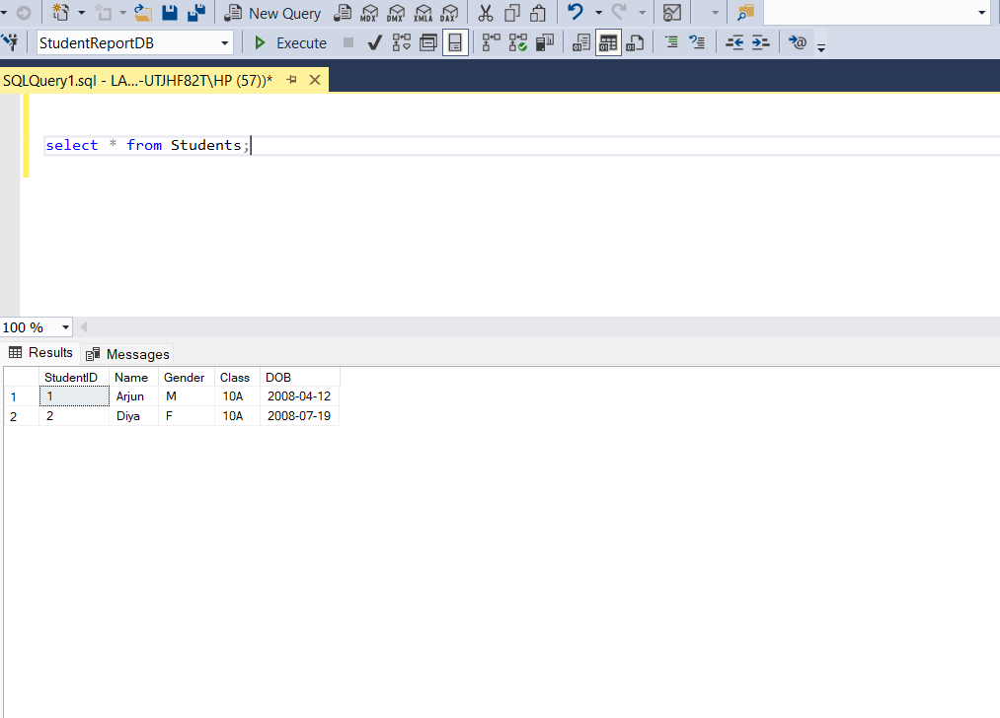
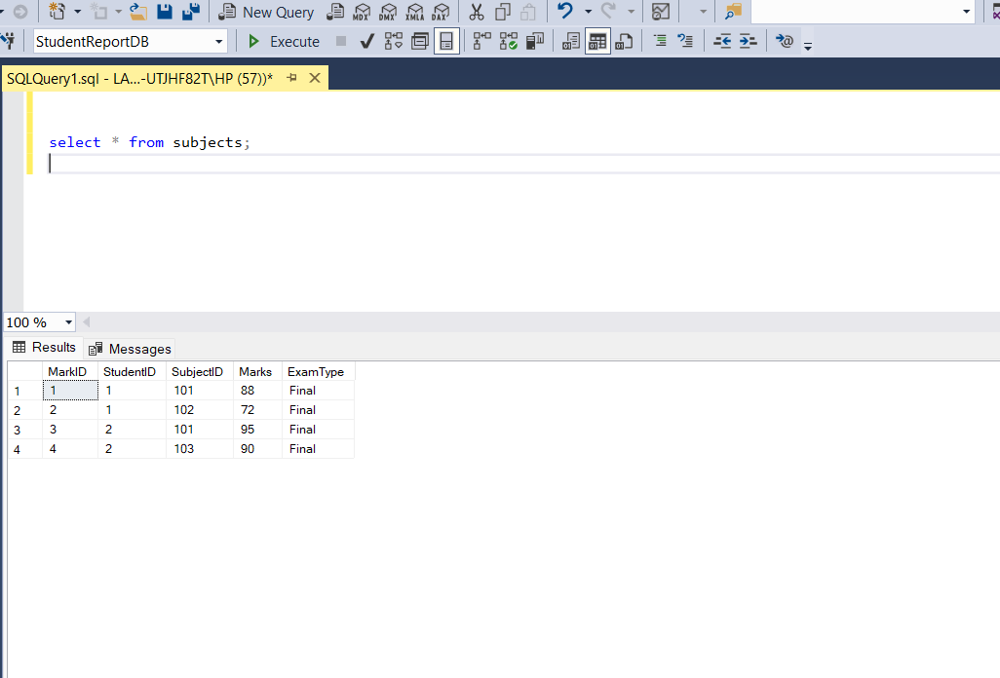
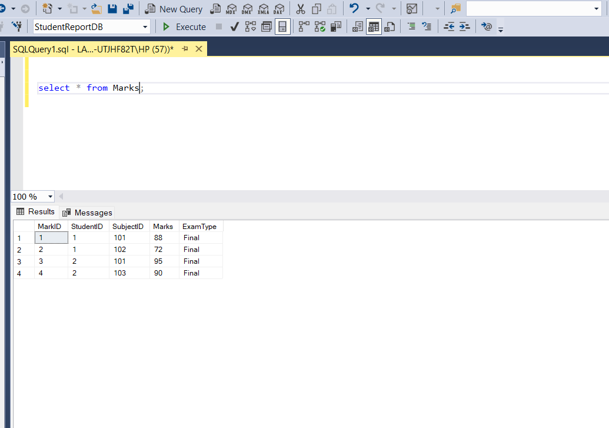
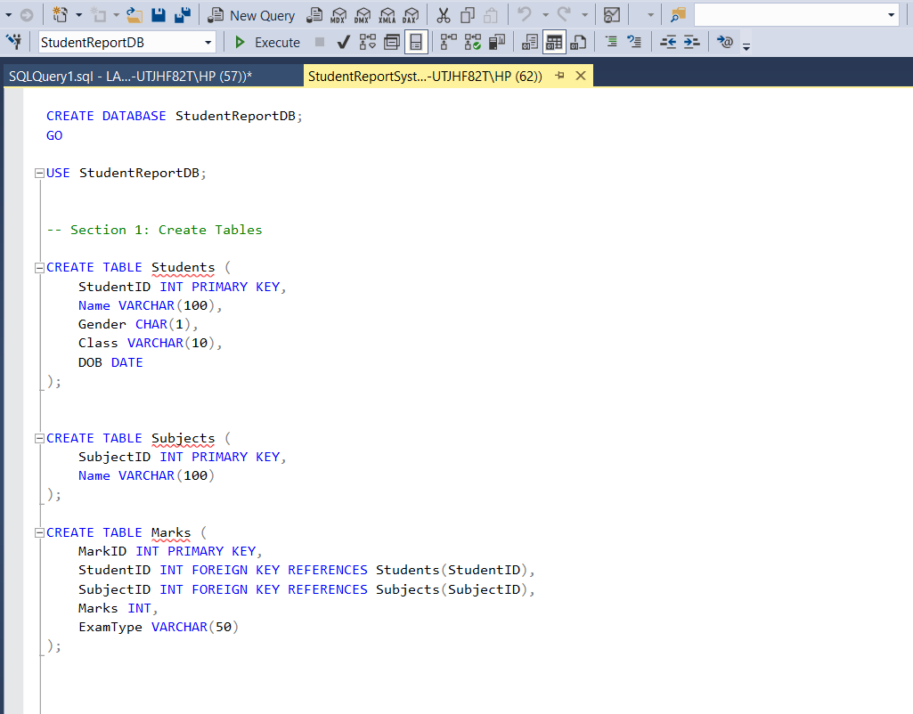
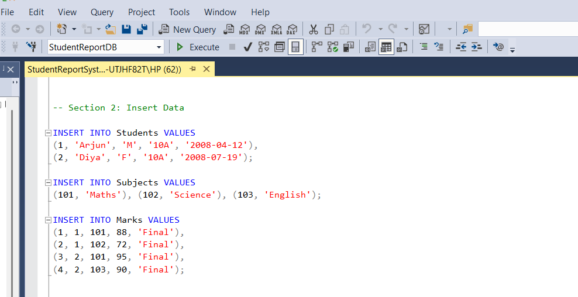
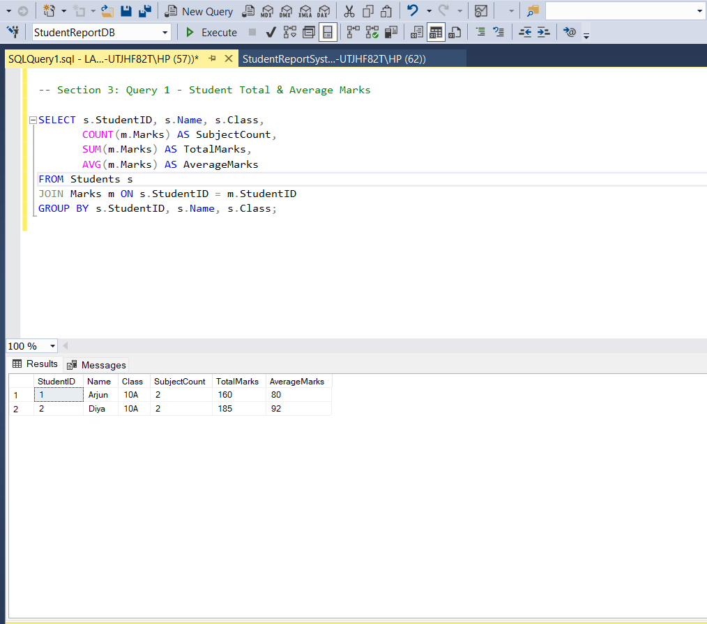
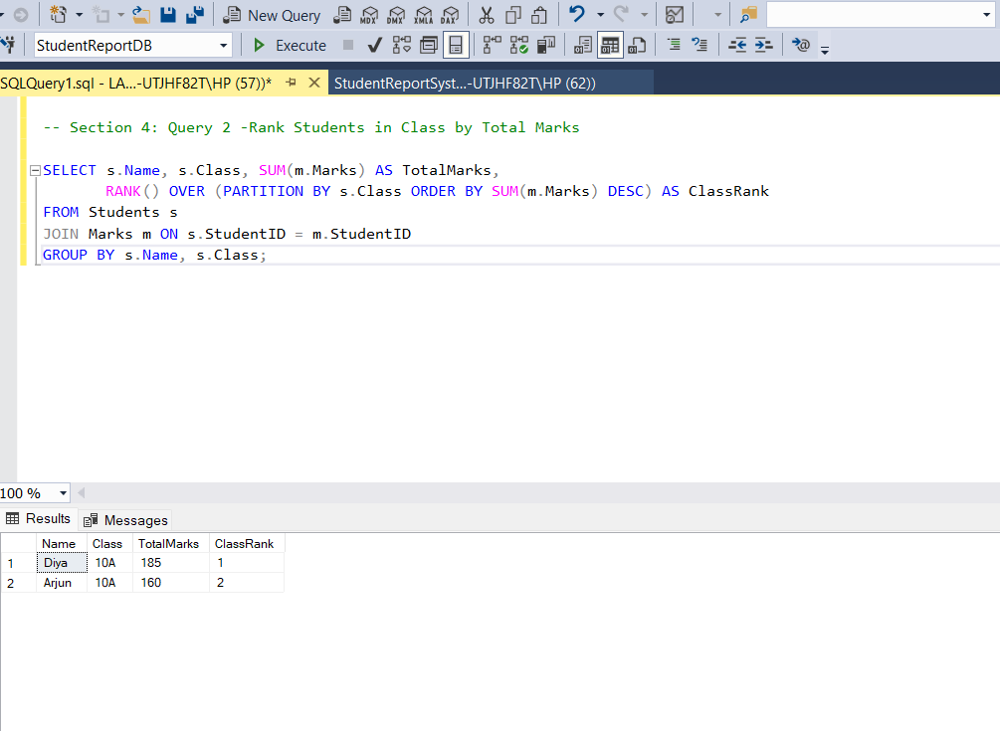
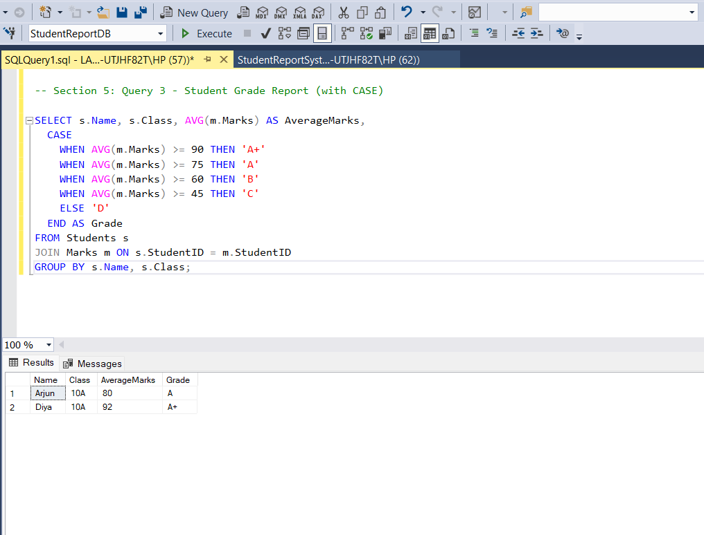
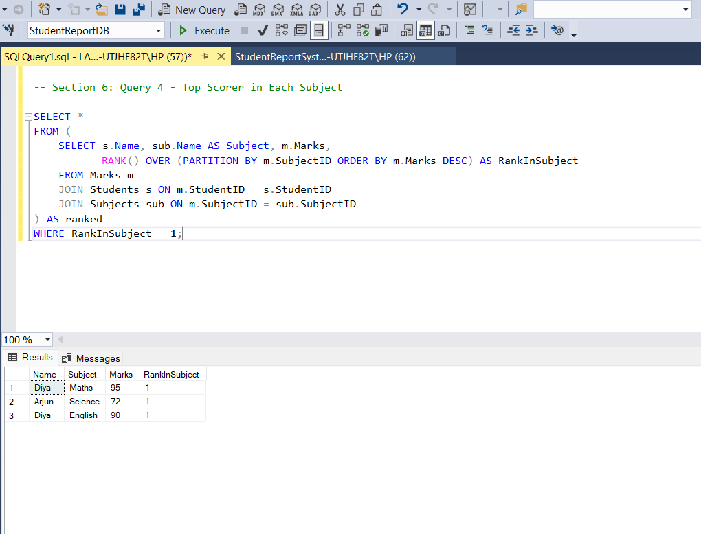
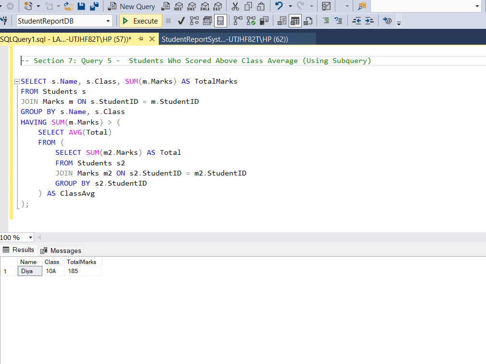

# 📝 Student Report System (SQL Server Project)

## 📚 Project Overview

This is a mini SQL project built using **SQL Server Management Studio (SSMS)** that simulates a student report generation system. The project includes:
- Database design
- Table creation
- Data insertion
- Aggregation, joins, and subqueries
- Window functions (RANK, etc.)

---

## 🗃️ Database Schema

### Tables Used:
1. **Students**
    - StudentID (PK), Name, Gender, Class, DOB
2. **Subjects**
    - SubjectID (PK), Name
3. **Marks**
    - MarkID (PK), StudentID (FK), SubjectID (FK), Marks, ExamType

📸 Screenshot:
  
  
  

---

## 🧱 Table Creation

```sql
CREATE TABLE Students (
    StudentID INT PRIMARY KEY,
    Name VARCHAR(100),
    Gender CHAR(1),
    Class VARCHAR(10),
    DOB DATE
);

CREATE TABLE Subjects (
    SubjectID INT PRIMARY KEY,
    Name VARCHAR(100)
);

CREATE TABLE Marks (
    MarkID INT PRIMARY KEY,
    StudentID INT FOREIGN KEY REFERENCES Students(StudentID),
    SubjectID INT FOREIGN KEY REFERENCES Subjects(SubjectID),
    Marks INT,
    ExamType VARCHAR(50)
);
```

📸 Screenshot:  


---

## 🗳️ Insert Data

```sql
INSERT INTO Students VALUES
(1, 'Arjun', 'M', '10A', '2008-04-12'),
(2, 'Diya', 'F', '10A', '2008-07-19');

INSERT INTO Subjects VALUES
(101, 'Maths'), (102, 'Science'), (103, 'English');

INSERT INTO Marks VALUES
(1, 1, 101, 88, 'Final'),
(2, 1, 102, 72, 'Final'),
(3, 2, 101, 95, 'Final'),
(4, 2, 103, 90, 'Final');
```

📸 Screenshot:  


---

## 🔍 Query 1: Student Total & Average Marks

```sql
SELECT s.StudentID, s.Name, s.Class,
       COUNT(m.Marks) AS SubjectCount,
       SUM(m.Marks) AS TotalMarks,
       AVG(m.Marks) AS AverageMarks
FROM Students s
JOIN Marks m ON s.StudentID = m.StudentID
GROUP BY s.StudentID, s.Name, s.Class;
```

📸 Screenshot:  


---

## 🏆 Query 2: Rank Students in Class

```sql
SELECT s.Name, s.Class, SUM(m.Marks) AS TotalMarks,
       RANK() OVER (PARTITION BY s.Class ORDER BY SUM(m.Marks) DESC) AS ClassRank
FROM Students s
JOIN Marks m ON s.StudentID = m.StudentID
GROUP BY s.Name, s.Class;
```

📸 Screenshot:  


---
## 🏆 Query 3: Student Grade Report

```sql
SELECT s.Name, s.Class, AVG(m.Marks) AS AverageMarks,
  CASE 
    WHEN AVG(m.Marks) >= 90 THEN 'A+'
    WHEN AVG(m.Marks) >= 75 THEN 'A'
    WHEN AVG(m.Marks) >= 60 THEN 'B'
    WHEN AVG(m.Marks) >= 45 THEN 'C'
    ELSE 'D'
  END AS Grade
FROM Students s
JOIN Marks m ON s.StudentID = m.StudentID
GROUP BY s.Name, s.Class;
```

📸 Screenshot:  


---

## 🥇 Query 4: Top Scorer in Each Subject

```sql
SELECT *
FROM (
    SELECT s.Name, sub.Name AS Subject, m.Marks,
           RANK() OVER (PARTITION BY m.SubjectID ORDER BY m.Marks DESC) AS RankInSubject
    FROM Marks m
    JOIN Students s ON m.StudentID = s.StudentID
    JOIN Subjects sub ON m.SubjectID = sub.SubjectID
) AS ranked
WHERE RankInSubject = 1;
```

📸 Screenshot:  


---

## 🎯 Query 5: Students Above Class Average

```sql
SELECT s.Name, s.Class, SUM(m.Marks) AS TotalMarks
FROM Students s
JOIN Marks m ON s.StudentID = m.StudentID
GROUP BY s.Name, s.Class
HAVING SUM(m.Marks) > (
    SELECT AVG(Total)
    FROM (
        SELECT SUM(m2.Marks) AS Total
        FROM Students s2
        JOIN Marks m2 ON s2.StudentID = m2.StudentID
        GROUP BY s2.StudentID
    ) AS ClassAvg
);
```

📸 Screenshot:  


---

## 📂 Suggested Folder Structure

```
StudentReportSystem/
├── StudentReportSystem.sql
├── Student_Report_System_Guide.docx
├── README.md
└── screenshots/
    ├── create_tables_query.png
    ├── insert_data_query.png
    ├── marks_table.png
    ├── query1_total_average.png
    ├── query2_class_rank.png
    ├── query3_grade_case.png
    ├── query4_subject_topper.png
    ├── query5_above_avg.png
    ├── schema_design.png
    ├── student_table.png
    ├── subject_table.png
```

---

✅ **Built With:**
- *SQL Server Management Studio (SSMS)*
- *AdventureWorks-style Schema (custom simulated structure)*
✅ **Level:** Beginner to Intermediate SQL Practice  
✅ **Author:** Nishma P
